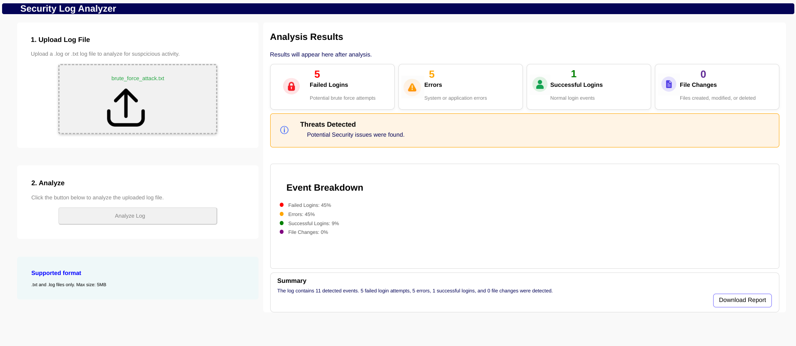

# security-log-analyzer

A full-stack web application that allows users to upload `.log` or `.txt` files and analyze them for common security-related activity.

The Security Log Analyzer uses an HTML/CSS frontend, JavaScript for user interaction and communication with the backend, and a Python FastAPI backend to process uploaded log files. The backend searches the log for recognized security events and returns the results to the frontend as JSON. JavaScript then uses those results to dynamically update the analysis dashboard.

The analyzer currently identifies:

- Failed login attempts
- Successful logins
- System or application errors
- File changes
- Overall detected event activity

The goal of this project was to build a practical cybersecurity application while gaining experience with frontend development, backend development, APIs, Python, JavaScript, file processing, and dynamic web interfaces.

## Project Preview

The application provides a single dashboard where users can upload a log file, initiate analysis, and view the resulting security statistics.

## Features
- Upload `.log` and `.txt` files
- Maximum file size validation of 5 MB
- Python-based log processing
- FastAPI backend
- REST API communication between the frontend and backend
- Detection of failed login attempts
- Detection of successful login activity
- Detection of system and application errors
- Detection of file creation, modification, and deletion events
- Automatic event counting
- Event percentage calculations
- Dynamic security status messages
- Automatically generated analysis summaries
- Downloadable analysis report
- Dashboard-style user interface

# Application Architecture

The Security Log Analyzer uses a frontend/backend architecture.

The general data flow is:

```text
User Selects Log File
        |
        v
JavaScript Validates File
        |
        v
JavaScript Creates FormData
        |
        v
POST /upload/
        |
        v
Python / FastAPI Backend
        |
        v
Log File Is Read and Analyzed
        |
        v
Security Events Are Counted
        |
        v
JSON Response Returned
        |
        v
JavaScript Receives Results
        |
        v
Dashboard Is Updated
```

# Technologies Used

The Security Log Analyzer was built using a combination of frontend and backend technologies. Each technology serves a different purpose within the application.

## Frontend

### HTML5

HTML provides the structure of the application and organizes the different components of the dashboard.

The HTML interface includes:

- File upload section
- Analyze button
- Supported file format information
- Analysis result cards
- Analysis status section
- Event breakdown
- Analysis summary
- Download report button

### CSS3

CSS is used to style and organize the application's user interface.

The project uses CSS to create:

- A dashboard-style layout
- CSS Grid and Flexbox positioning
- Result cards
- Custom file upload controls
- Security status indicators
- Event category indicators
- Responsive sizing and spacing
- Custom icons and buttons

### JavaScript

JavaScript controls the interactive behavior of the frontend and communicates with the Python backend.

JavaScript is responsible for:

- Detecting when a user selects a file
- Validating the uploaded file size
- Storing the selected file
- Creating a `FormData` object
- Sending the file to the FastAPI backend using `fetch()`
- Receiving the JSON response from the backend
- Updating the result cards
- Calculating event percentages
- Updating the analysis status
- Generating the analysis summary
- Handling frontend errors

---

## Backend

### Python

Python performs the actual analysis of the uploaded log file.

After receiving a file, the backend reads its contents, separates the log into individual lines, and checks each line for supported security-related patterns.

The Python backend counts four main types of activity:

- Failed login attempts
- Successful logins
- Errors
- File changes

### FastAPI

FastAPI is used to create the backend API.

The application contains a `POST` endpoint at:

`/upload/`

This endpoint receives the log file sent by JavaScript and passes it to the Python analysis logic.

After the file has been analyzed, FastAPI returns the results to the frontend as JSON.

### Uvicorn

Uvicorn is used as the ASGI server that runs the FastAPI application during development.

### CORS Middleware

CORS middleware is enabled so that the frontend and backend can communicate while running from separate development servers.

---

# How to Use the Application

Using the Security Log Analyzer involves three main steps.

## Step 1 — Upload a Log File

Click the upload area under **Upload Log File** and select a file from your computer.

The application currently accepts:

- `.log`
- `.txt`

The maximum supported file size is **5 MB**.

When a valid file is selected, the name of the selected file appears in the upload area.

If a file exceeds the 5 MB limit, the application rejects the file and displays an error message.

## Step 2 — Analyze the Log

After selecting a valid file, click the **Analyze Log** button.

JavaScript packages the selected file inside a `FormData` object and sends it to the FastAPI backend using an HTTP `POST` request.

The request is sent to the `/upload/` endpoint.

The basic communication process is:

```text
Selected Log File
       |
       v
JavaScript FormData
       |
       v
POST /upload/
       |
       v
FastAPI Backend
```

If the Analyze Log button is clicked without a valid file selected, the application alerts the user to upload a file first.

## Step 3 — Review the Results

Once the backend finishes analyzing the file, the results are returned to JavaScript and displayed automatically on the dashboard.

The user can review:

- Number of failed login attempts
- Number of errors
- Number of successful logins
- Number of file changes
- Percentage breakdown of detected events
- Overall analysis status
- Generated analysis summary


# Backend Log Analysis

The security analysis is performed by the Python backend rather than directly in the browser.

When FastAPI receives the uploaded file, Python:

1. Reads the contents of the file.
2. Decodes the file as text.
3. Separates the contents into individual log lines.
4. Converts each line to uppercase for consistent keyword matching.
5. Searches each line for supported security event patterns.
6. Updates the appropriate event counters.
7. Returns the final counts to the frontend.

This approach separates the analysis logic from the user interface.

# Security Event Detection

The current version of the analyzer uses keyword-based detection to identify supported events.

## Failed Login Attempts

The backend recognizes failed authentication activity using patterns such as:

```text
FAILED PASSWORD
LOGIN FAILED
AUTHENTICATION FAILURE
```

Each matching line increases the failed login counter.

Repeated failed authentication attempts may be useful when investigating suspicious login activity or potential brute-force behavior.

## Successful Logins

Successful authentication events are identified using patterns such as:

```text
ACCEPTED PASSWORD
LOGIN SUCCESSFUL
SESSION OPENED
```

Each matching line increases the successful login counter.

Tracking successful logins provides context when comparing normal authentication activity with failed authentication attempts.

## Errors

The backend recognizes error-related activity using:

```text
ERROR
CRITICAL
EXCEPTION
```

Each matching line increases the error counter.

These events may represent system or application problems that should be reviewed.

## File Changes

File activity is identified using:

```text
CREATED
MODIFIED
DELETED
```

Each matching line increases the file change counter.

This allows the analyzer to identify basic file creation, modification, and deletion activity within supported logs.

# API Communication

Communication between the frontend and backend is handled through an HTTP request and JSON response.

## Sending the File

After the user clicks **Analyze Log**, JavaScript creates a `FormData` object and attaches the uploaded file using the field name:

`log_file`

The file is then sent to the FastAPI `/upload/` endpoint using a `POST` request.

## Backend Response

After Python completes the analysis, FastAPI returns a JSON response structured like:

```json
{
    "status": "success",
    "filename": "example.log",
    "failed_logins": 5,
    "successful_logins": 1,
    "errors": 2,
    "file_changes": 3
}
```

The exact values depend on the contents of the uploaded log.

JavaScript reads these values and updates the appropriate elements on the dashboard without requiring the page to reload.

# Understanding the Results

## Analysis Result Cards

Four cards at the top of the results dashboard display the raw number of detected events.

### Failed Logins

Displays the total number of recognized failed authentication attempts.

### Errors

Displays the total number of recognized error events.

### Successful Logins

Displays the total number of recognized successful authentication events.

### File Changes

Displays the total number of recognized file creation, modification, or deletion events.

## Analysis Status

The status section gives the user a quick interpretation of the results.

Before analysis, the application displays:

**No Analysis Performed Yet**

After analysis, the status changes based on the activity returned by the backend.

If failed logins or errors are present, the application displays a warning that potential security issues were found.

If successful logins or file changes are present without failed logins or errors, the application reports that activity was detected but no suspicious login attempts or system errors were found.

If no supported events are detected, the application reports that no suspicious activity was detected.

# Event Breakdown

The Event Breakdown section converts the raw event counts into percentages.

First, JavaScript calculates the total number of detected events:

```text
Failed Logins
+ Errors
+ Successful Logins
+ File Changes
= Total Detected Events
```

Each event percentage is then calculated using:

```text
Event Percentage = (Event Count / Total Detected Events) × 100
```

The percentages are rounded and displayed next to colored indicators for:

- Failed Logins
- Errors
- Successful Logins
- File Changes

This provides another way to understand the distribution of activity within the uploaded log.

# Analysis Summary

The Summary section provides a readable description of the results.

For example, an analysis may produce:

```text
The log contains 11 detected events. 5 failed login attempts,
2 errors, 1 successful login, and 3 file changes were detected.
```

The generated message changes depending on the results.

If no recognized events are detected, the application reports that no recognized security activity was found.

If normal activity is detected without failed login attempts or errors, the summary indicates that activity was found but no suspicious activity was detected.

This provides users with both numerical results and a written interpretation of the analysis.

# File Validation and Error Handling

The application includes several checks to prevent common errors.

## File Size Validation

Uploaded files are limited to **5 MB**.

JavaScript checks the file size before storing the selected file.

If the file exceeds the limit:

- An error message is displayed.
- The file input is reset.
- The invalid file is removed.
- The file cannot be submitted for analysis.

## No File Selected

If the user clicks **Analyze Log** without selecting a valid file, an alert asks the user to upload a file.

## Failed Backend Request
JavaScript checks whether the HTTP response from FastAPI was successful before attempting to process the returned data.

## Backend Connection Error

If the frontend cannot communicate with the Python backend, the error is caught and the user is notified that the connection failed.

### `index.html`

Contains the structure of the user interface.

### `style.css`

Contains the visual styling and layout of the dashboard.

### `script.js`

Handles user interaction, file validation, API communication, percentage calculations, and dynamic dashboard updates.

### `main.py`

Contains the FastAPI backend, file processing, and security event detection logic.

### `images/`

Contains icons, interface images, and README screenshots.

# Running the Project Locally

Both the frontend and backend must be running for the application to perform log analysis.

## 1. Clone the Repository

```bash
git clone <your-repository-url>
```

Then navigate into the project:

```bash
cd security-log-analyzer
```

## 2. Install Backend Dependencies

The Python backend requires FastAPI, Uvicorn, and multipart form-data support.

If the repository contains a `requirements.txt` file, run:

```bash
pip install -r requirements.txt
```

## 3. Start the Python Backend

Open a terminal in the project directory and run:

```bash
python3 main.py
```

The FastAPI backend runs on port `5000`.

## 4. Start the Frontend

Open a second terminal and run:

```bash
python3 -m http.server 8000
```

The frontend runs on port `8000`.

## 5. Open the Application

For local development, navigate to:

```text
http://localhost:8000
```

Keep both terminals running while using the application.

---

# Development Process

The project was developed incrementally, beginning with the user interface and gradually connecting it to backend security analysis.

## Phase 1 — Building the Interface

The initial HTML established the main sections of the application:

- Upload Log File
- Analyze
- Supported Format
- Analysis Results
- Analysis Status
- Event Breakdown
- Summary

## Phase 2 — Designing the Dashboard

CSS Grid and Flexbox were used to organize the application into a dashboard layout.

Individual cards were created for each security event category, and the upload controls, analysis status, Event Breakdown, and Summary were styled separately.

## Phase 3 — Implementing File Uploads

A file input was added for `.log` and `.txt` files.

The browser's standard file input was hidden and replaced with a custom upload interface.

JavaScript was used to capture and store the selected file.

## Phase 4 — Adding File Validation

JavaScript validation was added to enforce the 5 MB maximum file size.

Invalid files are rejected before being sent to the backend.

## Phase 5 — Creating the FastAPI Backend

A Python backend was created using FastAPI.

An `/upload/` endpoint was implemented to receive files submitted by the frontend.

## Phase 6 — Connecting Frontend and Backend

JavaScript's `fetch()` API and `FormData` were used to send the selected log file to FastAPI.

CORS middleware was configured to allow communication between the frontend and backend development servers.

## Phase 7 — Implementing Security Detection

Python logic was added to read each uploaded log and search individual lines for supported security-related patterns.

Counters were used to track failed logins, successful logins, errors, and file changes.

## Phase 8 — Returning JSON Data

After analysis, FastAPI returns the event counts and filename as JSON.

JavaScript receives and processes this response.

## Phase 9 — Updating the Dashboard

The values returned by Python are connected to HTML elements through JavaScript.

This allows the result cards to update immediately after analysis without refreshing the webpage.

## Phase 10 — Adding Event Percentages

JavaScript calculates the percentage represented by each detected event category.

These percentages are displayed in the Event Breakdown section.

## Phase 11 — Adding Dynamic Status Logic

Conditional logic was added to change the analysis status depending on the returned results.

The status can distinguish between potentially suspicious activity, normal detected activity, and logs containing no recognized events.

## Phase 12 — Generating Analysis Summaries

The Summary section was connected to the results so that a readable description is automatically generated after each analysis.

## Phase 13 — Refining the User Interface

The dashboard went through several rounds of layout and usability improvements.

These included:

- Aligning the result cards
- Standardizing icon positioning
- Centering the upload interface
- Preventing overlapping components
- Improving spacing
- Removing duplicate components
- Simplifying the Event Breakdown
- Removing unnecessary visualizations
- Removing the unused Recent Events section
- Reducing unnecessary whitespace

The final design focuses on presenting the most useful analysis information without overwhelming the user.

---

# Design Decisions

## Separating Frontend and Backend Responsibilities

The application intentionally separates presentation and analysis responsibilities.

**Python/FastAPI handles:**

- Receiving uploaded files
- Reading log contents
- Parsing log entries
- Detecting security events
- Counting detected activity
- Returning structured results

**JavaScript handles:**

- User interaction
- Client-side validation
- API requests
- Receiving JSON
- Percentage calculations
- Dashboard updates
- Analysis status
- User-facing summaries

**HTML/CSS handles:**

- Application structure
- Dashboard layout
- Visual presentation

This separation provides a cleaner application structure and makes it easier to expand the analysis capabilities in the future.

---

# Current Limitations

The current analyzer uses keyword-based event detection.

Log formats vary between operating systems, applications, servers, and security products. Because of this, events using patterns that are not currently supported may not be recognized.

Additionally, a failed login or error does not automatically represent a security breach. The application highlights activity that may deserve further investigation rather than making a definitive determination that a system has been compromised.

The application is intended as a lightweight educational security analysis tool and is not a replacement for professional SIEM, endpoint detection, monitoring, or incident-response software.

---

# Future Improvements

Possible future improvements include:

- Support for additional log formats
- IP address extraction
- Username extraction
- Timestamp extraction
- Brute-force threshold detection
- Repeated failed-login detection
- Event severity classifications
- Regular-expression-based detection
- Advanced filtering
- Search functionality
- Multiple-file analysis
- Database storage
- Historical analysis
- Additional report formats
- Backend deployment
- Machine-learning-based anomaly detection

---

# What I Learned

Building the Security Log Analyzer provided hands-on experience connecting frontend development, backend development, and cybersecurity concepts within one application.

The project provided experience with:

- Python
- FastAPI
- REST APIs
- HTTP POST requests
- JSON
- File uploads
- Backend file processing
- Text parsing
- Security log analysis
- JavaScript `fetch()`
- `FormData`
- DOM manipulation
- Event listeners
- Conditional logic
- Error handling
- HTML
- CSS Grid
- Flexbox
- Frontend/backend integration
- Debugging client-server communication

Most importantly, the project provided experience building a complete data flow between multiple technologies:

```text
User Interface
      |
      v
JavaScript
      |
      v
HTTP Request
      |
      v
FastAPI / Python
      |
      v
Log Analysis
      |
      v
JSON Response
      |
      v
JavaScript
      |
      v
Updated Dashboard
```

---

# Author

**Victoria Parra**

Computer Science  
Florida Atlantic University


